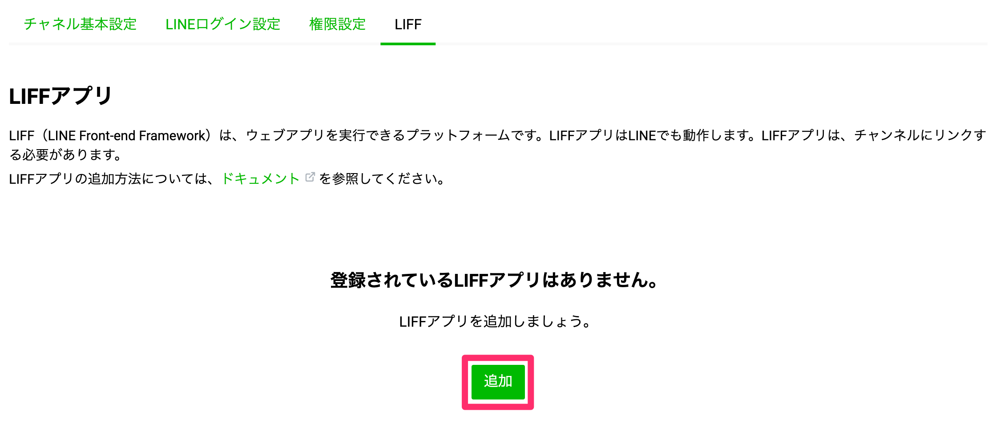
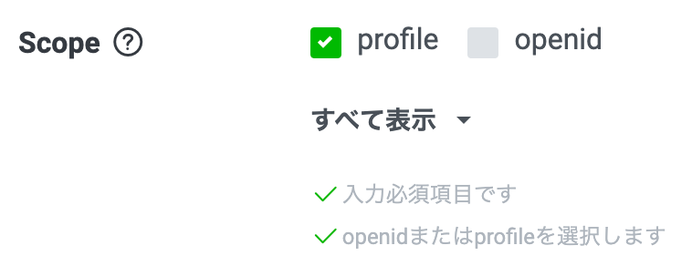
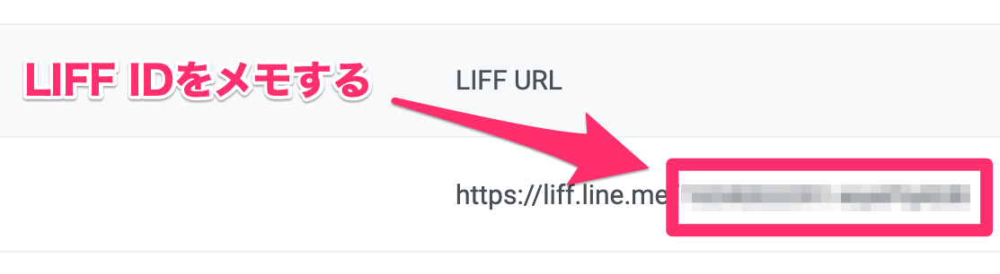

# Amplify Consoleを使ったLIFFアプリを開発する

[EN](./README.md)｜JA

## LIFF（LINE Front-end Framework）とは
LIFF（LINE Front-end Framework）は、LINE上でWebアプリを提供するプラットフォームです。
LIFFアプリでは、LINE IDやプロフィールなどのデータをLINEプラットフォームから取得することができます。
これらのデータを利用し、様々な機能を提供したりメッセージ送信が可能です。

## Amplify Consoleとは
Amplify Consoleは、フルスタックサーバーレスウェブアプリケーションをデプロイ・ホストするためのGitワークフローを提供しています。
アプリケーションのコードリポジトリをAmplify Consoleに接続するだけで利用でき、コミットのたびにワークフローにデプロイされます。

## ハンズオン

### LINE Developers
LINE Developersは、Messaging API・LINEログイン・Clovaスキル・LINE PayなどLINEが公開しているプロダクトを利用するための開発者プラットフォームです。
[チャネルを作成する](https://developers.line.biz/ja/docs/liff/getting-started/)を参考に`LINE Developersアカウント`の作成・`プロバイダー`の作成・`チャネル`の作成をします。
LIFFアプリは、`LINEログイン`のチャネルが必要ですので作成する時に注意してください。

### AWS

### LINE Developers-2

#### LIFFアプリの登録・デプロイ
LINE Developersで最初に作成したチャネル > タブで`LIFF`へアクセスします。
LIFFアプリの一覧が表示されるので`追加`をクリックし、`LIFFアプリ名`・`サイズ`・`エンドポイントURL`・`Scope`・`ボットリンク機能`を入力し追加してください。



##### 入力項目
項目名|説明|値
---|---|---
LIFFアプリ名|作成するアプリ名|`Handson`
サイズ|LIFFアプリを表示する画面サイズ|`Full`
エンドポイントURL|作成したアプリのURL（https）|`https://~`
Scope|許可する権限|`profile`
ボットリンク機能|紐づくMessaging APIチャネルの追加方法|`Off`





LIFFアプリが追加されるとLIFFアプリ一覧ページに戻り、登録されている`LIFFアプリ名`・`LIFF URL`・`サイズ`が表示されています。
LIFF URLの`https://liff.line.me/`以降がLIFF IDになりますのでソースコードの`liff.init`時に指定している`liffId`に追加してください。



```
liff.init({
    liffId: 'ADD_LIFF_ID_HERE'
})
```

これでデプロイ準備が完了です。

## Appendix